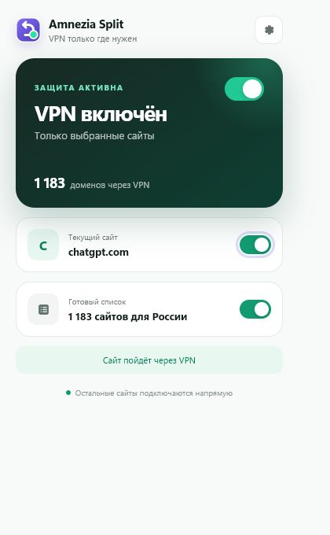

# Amnezia Split

Минималистичное расширение для Chrome и Brave: выбранные сайты идут через ваш сервер Amnezia, остальные — напрямую.



## Что умеет

- сразу включает ChatGPT, OpenAI, Sora и связанные домены;
- использует и ежедневно обновляет список заблокированных и геоограниченных ресурсов для России от [itdoginfo/allow-domains](https://github.com/itdoginfo/allow-domains);
- добавляет или исключает текущий сайт одним переключателем;
- не отправляет обычные сайты через VPN;
- хранит пароль прокси только в локальном хранилище браузера;
- при сбое прокси не переключает выбранный сайт на прямое соединение.

> Правила применяются по домену. Поэтому `chatgpt.com` будет идти через VPN во всех вкладках, а любой домен вне списка — напрямую. Один и тот же домен нельзя одновременно открыть через VPN в одной вкладке и напрямую в другой: API Chrome задаёт прокси на уровне профиля браузера.

## Установка в Brave

1. Скачайте проект и распакуйте его.
2. Откройте `brave://extensions`.
3. Включите **Режим разработчика** справа вверху.
4. Нажмите **Загрузить распакованное расширение** и выберите папку проекта.
5. На открывшейся странице введите пароль прокси и нажмите **Сохранить и проверить**.

Адрес `ton4.pro`, порт `18443` и логин `amnezia-browser` уже заполнены. Пароль не хранится в репозитории.

## Как пользоваться

Нажмите значок расширения:

- большой переключатель ставит всю выборочную маршрутизацию на паузу;
- переключатель **Текущий сайт** отправляет открытый домен через VPN или добавляет его в исключения;
- **Список для России** включает готовый набор доменов.

Дополнительные сайты и исключения видны в настройках расширения.

## Почему нужен отдельный прокси

Расширение браузера не умеет подключаться к туннелю Amnezia напрямую. На VPN-сервере развёрнут HTTPS CONNECT-прокси:

```text
Brave → TLS → ton4.pro:18443 → интернет
```

PAC-правила Chrome выбирают этот маршрут только для нужных доменов. TLS скрывает логин, пароль и запросы к прокси от провайдера. Подробности — в [документации сервера](docs/server.md).

## Разработка

Требуется Node.js 20 или новее.

```powershell
npm test
npm run package
```

Готовый ZIP появится в `dist/amnezia-split-extension.zip`.

## Приватность и разрешения

Расширение не собирает аналитику и не имеет внешнего бэкенда. Объяснение разрешений и работы с данными находится в [PRIVACY.md](PRIVACY.md).

Снимок `data/inside-raw.lst` получен из публичного списка [itdoginfo/allow-domains](https://github.com/itdoginfo/allow-domains/blob/main/Russia/inside-raw.lst) 15 июля 2026 года и может обновляться из того же источника кнопкой в интерфейсе.

## Лицензия

Код расширения распространяется по лицензии MIT. Список доменов принадлежит его авторам и сопровождается ссылкой на первоисточник.
