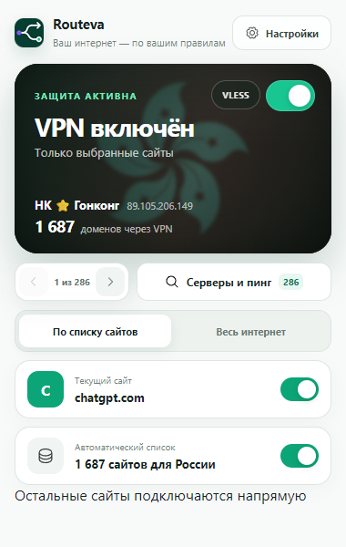
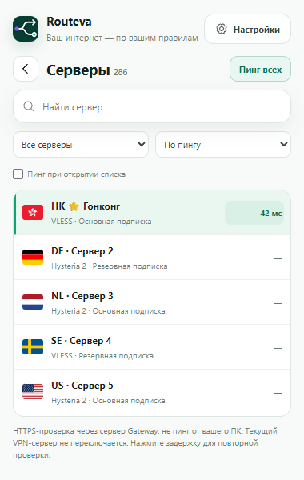

# Routeva

Минималистичное расширение для Chrome и Brave: отправляет через выбранный прокси нужные сайты или весь интернет.





## Что умеет

- направляет ChatGPT, OpenAI, Sora и домены из готового российского списка через прокси;
- переключается между режимами «По списку сайтов» и «Весь интернет»;
- ежедневно объединяет списки [itdoginfo/allow-domains](https://github.com/itdoginfo/allow-domains) и [Re-filter-lists](https://github.com/1andrevich/Re-filter-lists);
- показывает полный список доменов с поиском и источниками;
- поддерживает несколько серверов и переключает их перелистыванием карточки;
- открывает компактный список серверов прямо в popup: флаги, протоколы, поиск, фильтр по подписке и сортировка;
- проверяет задержку одного узла или всех отфильтрованных узлов через Gateway без переключения активного сервера;
- показывает страну и IP активного выхода;
- подключается к HTTP, HTTPS, SOCKS4 и SOCKS5-прокси;
- передаёт HTTPS-ссылки подписок на ваш собственный Routeva Gateway;
- запускает VLESS, VMess, Trojan, Shadowsocks, Hysteria 2, TUIC и WireGuard на сервере, без VPN-клиента на компьютере;
- хранит серверы и пароли в локальном профиле браузера, а секретные ссылки подписок — на вашем Gateway;
- показывает уведомление о новой версии в окне расширения, настройках и под панелью браузера.

> Chrome управляет прокси на уровне профиля и домена, а не отдельной вкладки. Поэтому разные домены могут идти разными маршрутами, но две вкладки одного домена одновременно разделить нельзя.

## Установка папкой в Brave

1. Скачайте исходники или релизный ZIP и распакуйте его.
2. Откройте `brave://extensions`.
3. Включите **Режим разработчика**.
4. Нажмите **Загрузить распакованное расширение** и выберите папку, в которой лежит `manifest.json`.
5. После новой версии замените файлы и нажмите круглую кнопку **Обновить** на карточке расширения.

CRX и системные политики больше не используются. Распакованное расширение Chrome/Brave не обновляет само; Routeva только сообщает о новой версии. После публикации версия из Chrome Web Store будет обновляться магазином автоматически.

## Подписки и протоколы

В настройках вставьте персональную HTTPS-ссылку подписки. Расширение передаст её только вашему Routeva Gateway. Gateway загрузит список, поднимет нужные VLESS/Hysteria2/Shadowsocks-туннели и вернёт безопасный список карточек без ключей.

Перелистывание карточки вызывает защищённый API Gateway и меняет активный выход. Brave всё время подключается к одному HTTPS-прокси, поэтому Happ, Amnezia, Xray и другие программы на компьютере не требуются.

Chrome предоставляет расширениям только HTTP, HTTPS, QUIC, SOCKS4 и SOCKS5. Поэтому протокольный движок работает на вашем сервере в отдельном изолированном экземпляре Mihomo; его внутренние порты доступны только через loopback.

Персональная ссылка подписки обычно содержит секретный ключ. Не публикуйте её в issue, скриншотах или GitHub. В репозитории нет пользовательских адресов, паролей и ссылок.

## Как пользоваться

- большой переключатель ставит VPN-маршрутизацию на паузу;
- переключатель режима выбирает VPN только для списка или для всего интернета;
- перелистывание зелёной карточки выбирает сервер;
- **Серверы и пинг** открывает полный список в том же окне; строка выбирает сервер, число справа запускает проверку;
- **Пинг всех** проверяет текущий фильтр (до трёх одновременно); **Стоп** отменяет оставшуюся очередь;
- переключатель **Текущий сайт** добавляет домен в VPN-маршрут или исключения;
- **Список для России** включает готовый набор доменов;
- **Посмотреть домены** открывает весь список с поиском.

При ошибке прокси выбранный домен не переключается на прямое соединение незаметно для пользователя.

## Пинг: что именно измеряется

Для пинга нужен Routeva Gateway **0.9.0 или новее**. Старый Gateway продолжает работать для подключения и выбора серверов; при проверке появится просьба обновить его. Инструкция обновления — [gateway/README.md](gateway/README.md#upgrade-to-090).

Это HTTPS URL-test в Mihomo: **Gateway → проверяемый узел → `https://www.gstatic.com/generate_204`**. Он проверяет работу туннеля и ответа тестового сайта, но **не включает задержку от вашего ПК до Gateway**, не является ICMP/TCP-пингом и не измеряет скорость скачивания. По смыслу соответствует проверке «через прокси» у [Happ](https://www.happ.su/main/ru/faq/ping); ICMP и TCP здесь не имитируются.

Проверка не меняет выбранный узел, PAC и режим маршрутизации. URL теста фиксирован на сервере, API принимает только ID существующего узла. Ручные HTTP/SOCKS-прокси не пингуются: для них потребовался бы отдельный механизм проверки, а не временная смена браузерного прокси. `—` означает «не проверялся», ошибки и тайм-ауты не превращаются в «0 мс».

Результаты хранятся только локально. Через пять минут помечаются устаревшими. Автопинг **выключен по умолчанию**; его можно включить для открытия списка. Он проверяет только устаревшие/непроверенные узлы текущего фильтра. Закрытие списка/окна останавливает очередь; до трёх уже запущенных проверок завершаются самостоятельно. Постоянного фонового пинга нет.

## Разработка и сборка

Требуется Node.js 20 или новее.

```powershell
npm install
npm test
npm run package
npm run package:store
npm run package:gateway
```

- `dist/routeva` — папка для установки через **Загрузить распакованное расширение**;
- `dist/routeva-extension.zip` — обычный релизный архив;
- `dist/routeva-0.9.0-store.zip` — архив для Chrome Web Store с `manifest.json` в корне;
- `dist/routeva-0.9.0-gateway.zip` — исходники и инструкция обновления Gateway без секретов.

`npm run test:all` запускает JS- и Python-тесты (нужен Python 3.10+). Для UI smoke-теста установите Playwright отдельно (`npm install --no-save playwright`), укажите путь к тестовому Chromium/Brave в `ROUTEVA_BROWSER_PATH` и выполните `npm run test:ui`. Тест использует изолированный временный профиль, не обычный профиль браузера. Можно указать установленный Playwright через `ROUTEVA_PLAYWRIGHT_PATH`.

Материалы и готовые ответы для магазина находятся в [docs/store](docs/store).

## Приватность

Расширение не собирает аналитику, не использует облако разработчика и не продаёт данные. Управляющий API работает на сервере, который указал пользователь. Полное описание — в [PRIVACY.md](PRIVACY.md).

## Лицензии

Код расширения распространяется по MIT. Локальные SVG-флаги взяты из [flag-icons](https://github.com/lipis/flag-icons), стрелки — из [Phosphor Icons](https://github.com/phosphor-icons/core) (MIT); тексты лицензий включены в `assets`. Списки доменов принадлежат их авторам и сопровождаются ссылками на первоисточники.
